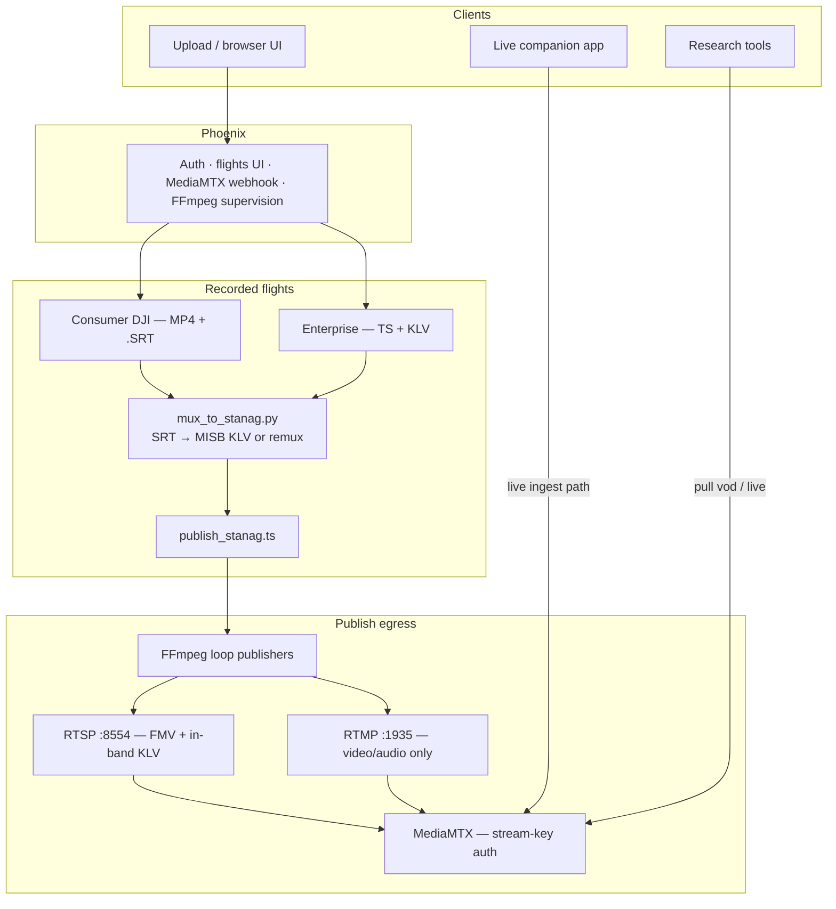

<p align="center">
  
</p>

# DroneFeed Webserver

Authenticated research webapp for uploading drone flights (FMV + SRT/KLV) and publishing them as pullable RTMP/RTSP feeds, plus live companion-app ingest with the same egress for research tools.

## Stack

- **Phoenix (Elixir)** — auth, flights UI, live sessions, MediaMTX auth webhook, FFmpeg supervision, 5-day retention
- **MediaMTX** — RTMP `:1935` / RTSP `:8554` ingest + pull
- **FFmpeg** — loops recorded flights into MediaMTX when Publish is toggled on
- **Postgres** — users, flights, live sessions

## Architecture



**Recorded publish (Public feed on)**

1. Flight assets land in storage (video + optional `.srt` / `.klv`).
2. `scripts/mux_to_stanag.py` builds a cached `publish_stanag.ts`:
   - **Consumer:** parse DJI `.srt` → encode MISB ST 0601 KLV → mux with video
   - **Enterprise:** remux existing MPEG-TS when a data/KLV stream is already present
3. FFmpeg loops that TS into MediaMTX; Phoenix authorizes publish/read via stream key.
4. Research tools pull **RTSP** for video + telemetry in one stream. **RTMP** is A/V only (FLV cannot carry KLV).
5. Original `.srt` / `.klv` sidecars remain available over HTTP metadata URLs when publishing.

**Browser UI** parses `.srt` (or extracted KLV) for the map and live readouts — that path is separate from the STANAG mux used for egress.

**Live ingest** skips the mux step: companion apps publish straight to MediaMTX; pull uses the same RTMP/RTSP ports and stream-key auth.

## Quick start (dev)

```bash
# Postgres on 5434 (already used by local docker drone-feed-db, or):
docker run -d --name drone-feed-db -e POSTGRES_PASSWORD=postgres -p 5434:5432 postgres:16-alpine

cd apps/web
mix deps.get
mix ecto.setup          # create + migrate + seed admin@localhost / admin
mix phx.server
```

Open http://localhost:4000 — request an account or log in with **admin@localhost** / **admin**, then use **Flights** and **Public Feeds** (admins also see **Admin** next to their name).

Re-seed later (idempotent):

```bash
./scripts/seed_dev.sh
# or: cd apps/web && mix seed
```

Demo fixtures (gitignored — download once):

```bash
./scripts/download_sample_data.sh
# → sample-data/consumer-dji/… and sample-data/enterprise-klv/Day_Flight.mpg
```

Run MediaMTX locally (auth → Phoenix):

```bash
docker run --rm --network host \
  -e MTX_AUTHHTTPADDRESS=http://127.0.0.1:4000/api/mediamtx/auth \
  -v "$PWD/deploy/mediamtx.yml:/mediamtx.yml" \
  bluenviron/mediamtx:1.11.3
```

## Production

See [deploy/README.md](deploy/README.md) for ports, EC2 sizing, DNS, and Let's Encrypt.

```bash
cd deploy
cp .env.example .env
# set SECRET_KEY_BASE, PHX_HOST, ACME_EMAIL, POSTGRES_PASSWORD,
# ADMIN_EMAIL, ADMIN_PASSWORD (≥8 chars), ADMIN_CONTACT, MEDIA_HOST
docker compose --env-file .env up -d --build
```

Caddy serves HTTPS on 443 with automatic certificate renewal. Point your domain's A record at the EC2 before (or right as) you start the stack.

## Layout

- `apps/web` — Phoenix application
- `images/` — brand mark (README + source); served from `apps/web/priv/static/images/`
- `deploy/` — MediaMTX config, Docker Compose, Dockerfile, `.env`
- `scripts/mux_to_stanag.py` — SRT→KLV / STANAG MPEG-TS normalize
- `scripts/extract_klv_track.py` — KLV → JSON for UI map/readouts
- `scripts/seed_dev.sh` — re-seed local admin
- `scripts/download_sample_data.sh` — fetch gitignored demo flights
- `scripts/ffmpeg_publish.sh` — manual republish helper
- `storage/` — uploaded flights (dev; created at runtime)
