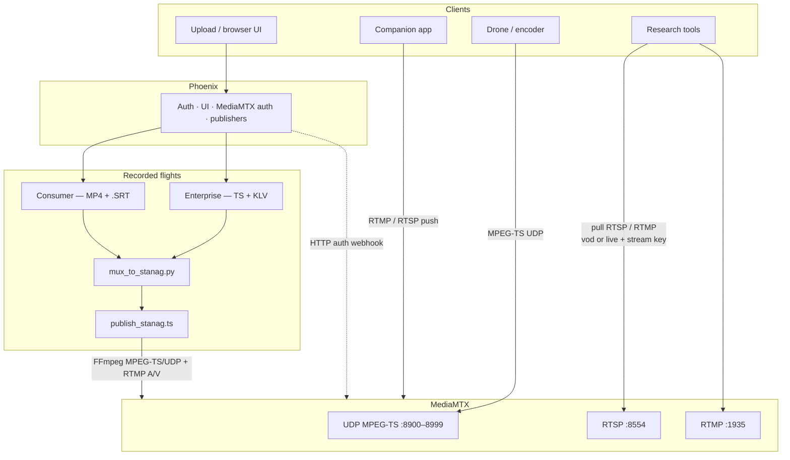

<p align="center">
  
</p>

<h1 align="center">DroneFeed</h1>

<p align="center"><strong>Research flight feeds</strong></p>

<p align="center">
  Upload FMV + SRT/KLV, publish pullable SRT/RTSP/RTMP, and share live companion or drone UDP ingest with your team.
</p>

## Stack

- **Phoenix (Elixir)** — auth, flights UI, live sessions, MediaMTX auth webhook, FFmpeg supervision, 5-day retention
- **MediaMTX** — SRT `:8890` (MPEG-TS + KLV), RTSP `:8554`, RTMP `:1935`; UDP `:8900–8999` for drone ingest and recorded republish
- **FFmpeg** — loops recorded STANAG TS into MediaMTX (`udp+mpegts`) when Public feed is on
- **Caddy** — HTTPS (Let's Encrypt) in front of Phoenix
- **Postgres** — users, flights, live sessions

## Architecture



**Recorded — Public feed on**

1. Flight assets land in storage (video + optional `.srt` / `.klv`).
2. `scripts/mux_to_stanag.py` builds a cached `publish_stanag.ts`:
   - **Consumer:** DJI `.srt` → MISB ST 0601 KLV → mux with video
   - **Enterprise:** remux existing MPEG-TS when a data/KLV stream is already present
3. Phoenix allocates a UDP port, configures the MediaMTX `vod/<id>` path as `udp+mpegts`, and FFmpeg loops the full TS (including KLV) into that listener. MediaMTX re-serves **SRT / RTSP / RTMP** pull (one source per path). Prefer **SRT** for H.264+KLV MPEG-TS; RTSP is RTP/SMPTE336M; RTMP is A/V-only.
4. Research tools authenticate as user `drone` with the flight stream key (`streamid=read:vod/<id>:drone:<key>` for SRT).
5. Original `.srt` / `.klv` sidecars stay available over HTTP metadata URLs while publishing.

**Browser UI** parses `.srt` (or extracted KLV) for Map View and live readouts — separate from the STANAG mux used for egress.

**Live ingest**

| Mode | How it enters MediaMTX | How tools pull |
|------|------------------------|----------------|
| **Companion push** | App publishes RTMP or RTSP to `/live/<id>` with stream key | Same RTMP/RTSP URLs + stream key |
| **Drone UDP** | Encoder sends MPEG-TS to `udp://MEDIA_IP:<port>` (port from `8900–8999`) | Same RTMP/RTSP pull URLs + stream key |

UDP ingest has no stream key on the wire — treat the allocated port as sensitive and tighten the security group when you can.

## Quick start (dev)

```bash
# Postgres on 5434 (already used by local docker drone-feed-db, or):
docker run -d --name drone-feed-db -e POSTGRES_PASSWORD=postgres -p 5434:5432 postgres:16-alpine

cd apps/web
mix deps.get
mix ecto.setup          # create + migrate + seed admin@localhost / admin
mix phx.server
```

Open http://localhost:4000 — request an account or log in with **admin@localhost** / **admin**, then use **Flights** and **Public Feeds** (admins also see **Admin** next to their name).

Re-seed later (idempotent):

```bash
./scripts/seed_dev.sh
# or: cd apps/web && mix seed
```

Demo fixtures (gitignored — download once):

```bash
./scripts/download_sample_data.sh
# → sample-data/consumer-dji/… and sample-data/enterprise-klv/Day_Flight.mpg
```

Run MediaMTX locally (auth → Phoenix):

```bash
docker run --rm --network host \
  -e MTX_AUTHHTTPADDRESS=http://127.0.0.1:4000/api/mediamtx/auth \
  -v "$PWD/deploy/mediamtx.yml:/mediamtx.yml" \
  bluenviron/mediamtx:1.15.6
```

## Production

See [deploy/README.md](deploy/README.md) for ports, EC2 sizing, DNS, and Let's Encrypt.

```bash
cd deploy
cp .env.example .env
# set SECRET_KEY_BASE, PHX_HOST, ACME_EMAIL, POSTGRES_PASSWORD,
# ADMIN_EMAIL, ADMIN_PASSWORD (≥8 chars), ADMIN_CONTACT, MEDIA_HOST,
# MEDIA_IP, UDP_INGEST_PORT_MIN/MAX (defaults 8900–8999)
docker compose --env-file .env up -d --build
```

Caddy serves HTTPS on 443 with automatic certificate renewal. Point your domain's A record at the EC2 before (or right as) you start the stack.

## Layout

- `apps/web` — Phoenix application
- `images/brand-mark.svg` — brand mark (README); also at `apps/web/priv/static/images/`
- `deploy/` — MediaMTX config, Docker Compose, Dockerfile, `.env`
- `scripts/mux_to_stanag.py` — SRT→KLV / STANAG MPEG-TS normalize
- `scripts/extract_klv_track.py` — KLV → JSON for UI map/readouts
- `scripts/seed_dev.sh` — re-seed local admin
- `scripts/download_sample_data.sh` — fetch gitignored demo flights
- `scripts/ffmpeg_publish.sh` — manual republish helper
- `storage/` — uploaded flights (dev; created at runtime)

## License

Copyright (C) 2026 Tim Feuerbach and contributors.

**[GNU Affero General Public License v3.0](LICENSE)** (`AGPL-3.0-only`).

Free to use, study, and modify. Keep copyright and license notices. Distributed or network-hosted modifications must offer corresponding source under AGPL-3.0.

Separate tools that only talk to a self-hosted DroneFeed over APIs/streams (and work without it) are not required to be AGPL solely because of that integration. Offering a modified DroneFeed itself as a network service is allowed under AGPL but requires providing that modified source to users of the service.
